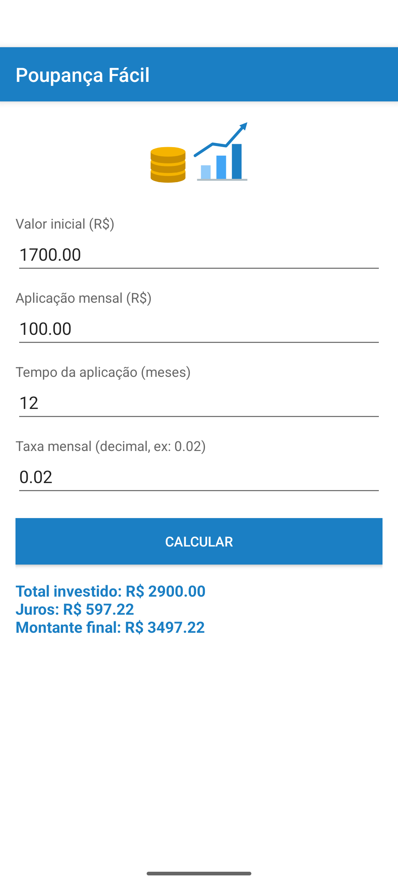
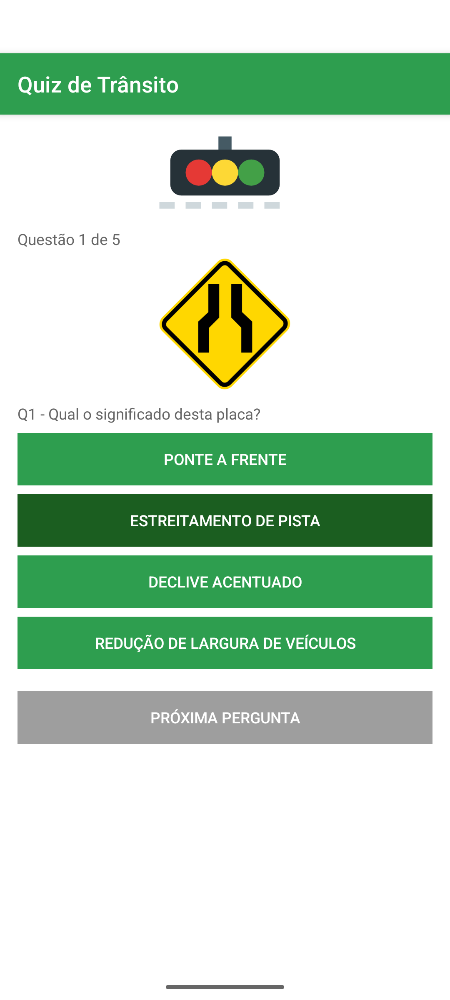
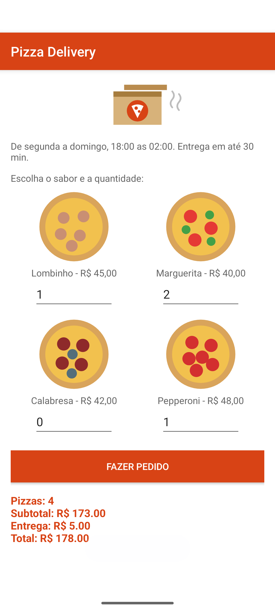
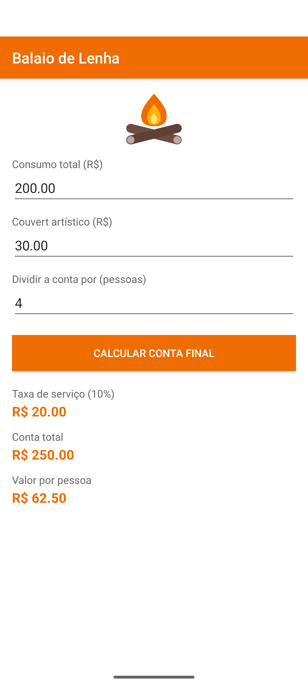
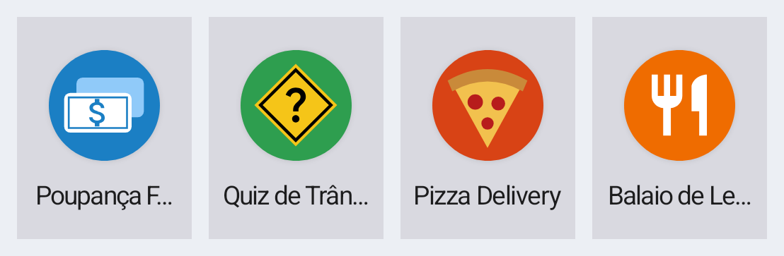
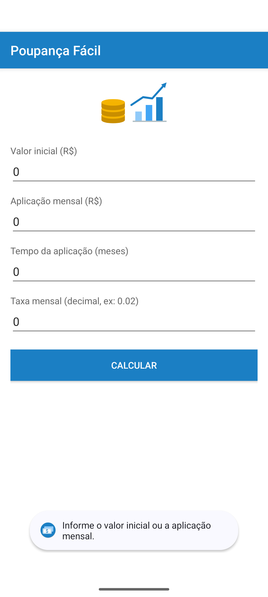
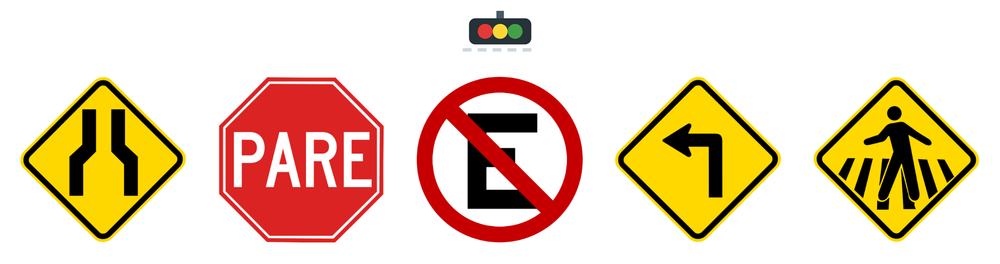

# Exercícios de Android

Quatro aplicativos Android feitos como exercício de layout e lógica. Cada pasta é um
projeto independente, que abre direto no Android Studio.

Java · `minSdk 24` · `targetSdk 35` · AppCompat · Gradle 9.7.1 · AGP 9.4.1

---

## 1. Poupança Fácil

Calcula o rendimento de uma aplicação com aporte mensal.



Fórmula usada (juros compostos com aportes):

```
montante = VI * (1 + i)^n + PMT * (((1 + i)^n - 1) / i)
```

A taxa precisa ser decimal: `0.02` para 2% ao mês. Digitar `2` é recusado, senão o
resultado sai inflacionado.

## 2. Quiz de Trânsito

Cinco placas, quatro alternativas cada. A correta fica verde-escuro, a errada vermelha,
e no fim mostra o placar.



As perguntas ficam em `res/values/strings.xml` como `<string-array>`; o índice da
resposta certa de cada questão está no array `gabarito` do `MainActivity`.

## 3. Pizza Delivery

Quatro sabores em grade, quantidade por sabor e total com taxa de entrega.



## 4. Balaio de Lenha

Conta de restaurante com couvert, taxa de serviço de 10% e divisão por pessoa.



A taxa de 10% incide apenas sobre o consumo. Para incluir o couvert, troque no
`MainActivity`:

```java
double taxa = (consumo + couvert) * PERCENTUAL_SERVICO;
```

---

## Organização de cada projeto

```
app/src/main
├── AndroidManifest.xml
├── java/layout/<app>/MainActivity.java
└── res
    ├── drawable/     ilustração do cabeçalho e do ícone
    ├── layout/       activity_main.xml
    ├── mipmap/       ícone do app
    └── values/       colors.xml · strings.xml · styles.xml
```

Os quatro seguem o mesmo padrão: cores em `colors.xml` (`primaria`, `primaria_escura`,
`fundo`, `rotulo`), textos em `strings.xml` e os estilos `AppTheme`, `Rotulo`, `Campo`,
`BotaoPrincipal` e `Resultado` em `styles.xml`. Cada app muda só a cor de destaque.



## Comportamento comum

- Os campos numéricos abrem em `0` e selecionam o conteúdo ao receber o toque.
- Com tudo zerado (ou em branco), o app avisa e não calcula.
- O resultado é limpo antes de cada cálculo, para não deixar valor antigo na tela.



## Detalhe técnico

Todo `ScrollView` usa `android:fitsSystemWindows="true"`. Sem isso, no Android 15 o
modo edge-to-edge é obrigatório e o topo da tela fica escondido atrás da barra de
título.

## Como rodar

1. Android Studio → **File → Open** → escolher a pasta de um dos exercícios.
2. Confirmar em **Trust Project**.
3. Esperar o Gradle sincronizar e clicar em ▶.

O arquivo `local.properties` não vai no repositório porque aponta para o SDK de uma
máquina específica. O Android Studio recria ele sozinho.

A pasta `apks/` traz os quatro aplicativos já compilados, prontos para instalar no
celular (é preciso liberar "instalar apps de fontes desconhecidas").

---

## Créditos das imagens

As placas do quiz vieram do Wikimedia Commons:



| Arquivo | Placa | Autor / licença |
|---|---|---|
| `placa1.png` | A-21a — Estreitamento de pista ao centro | DNIT — domínio público |
| `placa2.png` | R-1 — Parada obrigatória | Amateria1121 — CC BY-SA 3.0 |
| `placa3.png` | R-6a — Proibido estacionar | Amateria1121 — CC BY-SA 3.0 |
| `placa4.png` | A-1a — Curva acentuada à esquerda | DNIT — domínio público |
| `placa5.png` | A-32b — Passagem sinalizada de pedestres | DNIT — domínio público |

- https://commons.wikimedia.org/wiki/File:Brasil_A-21a.svg
- https://commons.wikimedia.org/wiki/File:Brasil_R-1.svg
- https://commons.wikimedia.org/wiki/File:Brasil_R-6a.svg
- https://commons.wikimedia.org/wiki/File:Brasil_A-1a.svg
- https://commons.wikimedia.org/wiki/File:Brasil_A-32b.svg

Os ícones dos aplicativos e as ilustrações de cabeçalho foram desenhados em vetor para
este trabalho.
